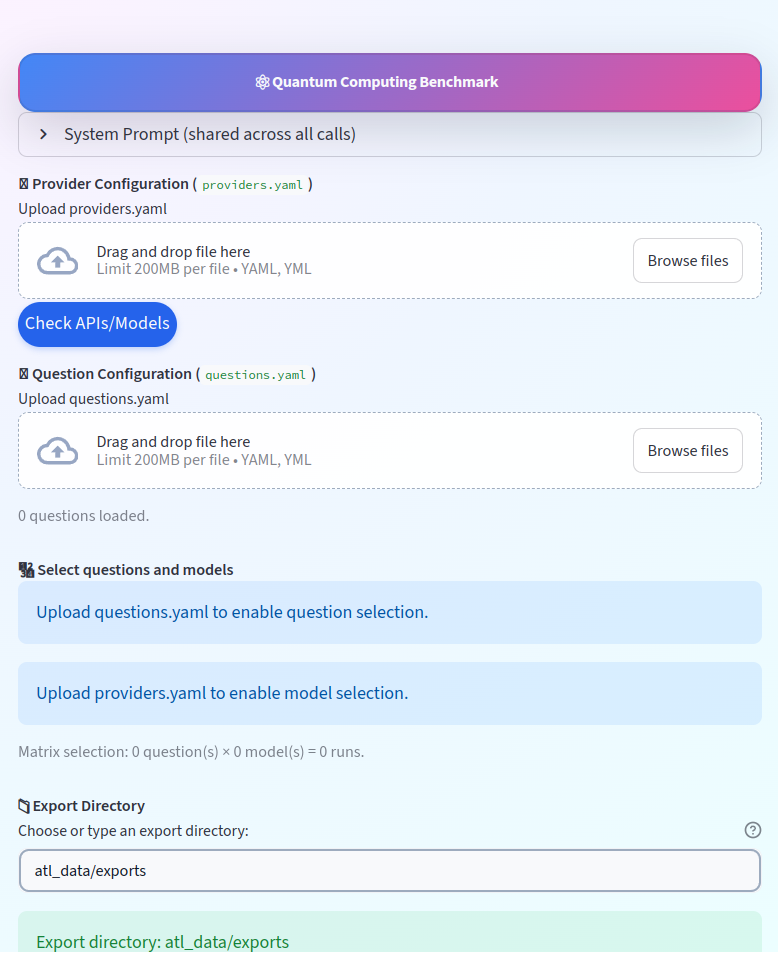

<!-- <p align="center">
  
</p> -->

<p align="center">
  <a href="https://github.com/kamalravi/intelligence-quantum-computing/actions">
    
  </a>
  
  
</p>

# IQC
A Streamlit-based benchmarking UI to evaluate multiple AI assistants / LLM providers across a shared question set, with per-call JSONL logging and quick preflight checks.

## Table of contents
- [IQC](#iqc)
  - [Table of contents](#table-of-contents)
  - [Features](#features)
  - [Preview](#interface-preview)
  - [Installation](#installation)
    - [Option 1: pip installation (coming soon)](#option-1-pip-installation-coming-soon)
    - [Option 2: source installation](#option-2-source-installation)
  - [Basic usage](#basic-usage)
    - [1. Run the UI](#1-run-the-ui)
    - [2. Input configuration](#2-input-configuration)
      - [2.1. providers.yaml](#21-providersyaml)
      - [2.2. questions.yaml](#22-questionsyaml)
    - [3. Matrix execution](#3-matrix-execution)
  - [Outputs](#outputs)
    - [Export directory](#export-directory)
    - [JSONL schema](#jsonl-schema)
  - [Repository layout](#repository-layout)
  - [Roadmap](#roadmap)
  - [Citation](#citation)
  - [Contribution](#contribution)
  - [License](#license)

## Features
1. YAML-driven provider/model configuration (`providers.yaml`)
2. YAML-driven question bank (`questions.yaml`)
3. Matrix benchmarking: **Questions × Models** with presets (Custom / All / None)
4. Preflight API/model check + downloadable CSV report
5. One JSONL file per call for reproducible analysis
6. UI-selectable export directory (auto-created if missing)

## Interface Preview

<p align="center">
  
</p>

## Installation
All provided installation methods allow running the Streamlit UI from source.

### Option 1: pip installation (coming soon)
Packaging to PyPI under `iqc` is planned but not released yet.

When released, it will look like:

```bash
pip install iqc
```

### Option 2: source installation

```bash
git clone https://github.com/kamalravi/intelligence-quantum-computing.git
cd intelligence-quantum-computing

python -m venv .venv
source .venv/bin/activate
pip install -r requirements.txt
```

## Basic usage

### 1. Run the UI

From the repository root:

```bash
streamlit run src/iqc/app.py
```

### 2. Input configuration

IQC requires two YAML files, uploaded via the UI.

#### 2.1. providers.yaml

Defines provider, model, API key, and sampling parameters.

Example:

```yaml
providers:
  - name: Groq
    model: llama-3.3-70b-versatile
    api_key: ${GROQ_API_KEY}
    temperature: 0.7
    max_tokens: 512
```

API keys should be supplied via environment variables:

```bash
export GROQ_API_KEY="..."
export OPENROUTER_API_KEY="..."
export MISTRAL_API_KEY="..."
export COHERE_API_KEY="..."
export CEREBRAS_API_KEY="..."
```

Start from the example file:

* `configs/providers.example.yaml`

#### 2.2. questions.yaml

Defines the question bank used for benchmarking.

Example:

```yaml
questions:
  - id: Q1
    text: "Explain the concept of qubits and superposition."
  - id: Q2
    text: "What are the limitations of current quantum hardware?"
```

Start from the example file:

* `configs/questions.example.yaml`

### 3. Matrix execution

1. Upload `providers.yaml` and `questions.yaml`
2. Select questions and models (Custom / All / None)
3. Run **Benchmark Matrix**
4. Monitor progress via the progress bar

Each question–model pair is executed independently and logged.

## Outputs

IQC writes one JSONL file per model–question call.

### Export directory

* Default: `atl_data/exports/`
* Can be overridden via the UI
* Directory is created automatically if missing

### JSONL schema

Each JSON object includes:

* `run_id`, `timestamp_utc`
* `provider`, `model`
* `temperature`, `max_tokens`
* `system_prompt` (and hash)
* `question_id`, `question_text`
* `response_text`
* `status`, `error_message`
* `latency_ms`

## Repository layout

```text
.
├─ configs/
│  ├─ providers.example.yaml
│  └─ questions.example.yaml
├─ src/
│  └─ iqc/
│     ├─ __init__.py
│     ├─ app.py        # Streamlit entrypoint
│     ├─ core.py       # provider logic + networking + export
│     └─ ui.py         # UI layout and styling
├─ images/
│  └─ logo.png
├─ atl_data/           # local outputs (gitignored)
├─ .streamlit/
│  └─ config.toml
├─ requirements.txt
├─ pyproject.toml
└─ README.md
```

## Roadmap

1. Package and publish to PyPI (iqc)
2. Add CI for linting and secret detection
3. Add evaluation hooks (scoring, aggregation, comparison)
4. Support batch experiment metadata and tagging

## Citation

If you use IQC in your research, please cite:

```bibtex
@software{iqc_software_2025,
  title  = {IQC},
  author = {Kamalakkannan Ravi and Siyuan Niu and Di Wu},
  year   = {2025},
  url    = {https://github.com/kamalravi/intelligence-quantum-computing}
}
```

## Contribution

We welcome contributions — open a pull request.

## License

See `LICENSE`.
